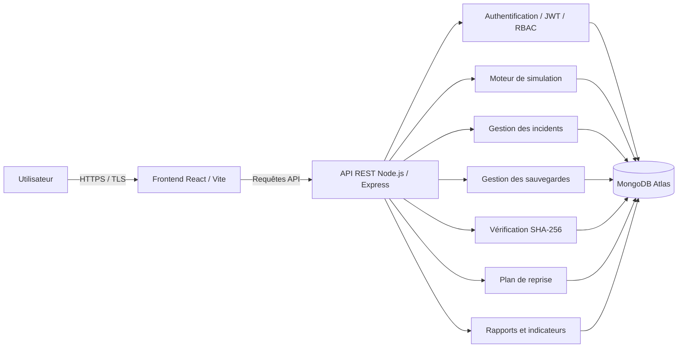

# 🛡️ Sentinel

## Simulateur web de résilience face aux rançongiciels

> Projet académique de **Master 1 Réseaux et Sécurité Informatique** consacré à la simulation contrôlée d’incidents de type rançongiciel et à l’étude des mécanismes de **résilience**, de **contrôle d’accès**, d’**intégrité** et de **reprise après incident**.


# 🎓 Contexte académique

| Information            | Détail                                    |
| ---------------------- | ----------------------------------------- |
| **Université**         | Université de Kinshasa                    |
| **Faculté**            | Faculté des Sciences                      |
| **Département**        | Mathématiques et Informatique             |
| **Filière**            | Master 1 Réseaux et Sécurité Informatique |
| **Cours**              | Protocoles de Sécurité Réseau             |
| **Année académique**   | 2025–2026                                 |
| **Titulaire du cours** | Prof. KASENGEDIA BOTUMBE                  |
| **Collaborateur**      | Doctorant KANINGINI LUTALA Junior         |

### 👥 Membres du groupe

| N° | Nom complet                    |
| -: | ------------------------------ |
|  1 | **TEMBWA NGENGO BENJI**        |
|  2 | **MBUYI MUTUNGILAYI Benjamin** |
|  3 | **KAZADI KABUYA Augustin**     |
|  4 | **LUABEYA MUKENDI Barnabé**    |

---

# 📌 Présentation du projet

**Sentinel** est une application web permettant de simuler, dans un environnement entièrement fictif et contrôlé, l’impact d’un incident de type **ransomware** sur les ressources d’une organisation.

L’application permet notamment de :

* gérer des utilisateurs, machines, serveurs, services et fichiers fictifs ;
* lancer différents scénarios d’incident ;
* observer les ressources compromises ;
* créer et vérifier des sauvegardes ;
* contrôler l’intégrité des données avec **SHA-256** ;
* gérer les incidents et leur cycle de vie ;
* restaurer les ressources affectées ;
* suivre un plan de reprise après incident ;
* appliquer un contrôle d’accès basé sur les rôles (**RBAC**) ;
* mesurer des indicateurs de résilience ;
* consulter des journaux et rapports d’incident.

> Les simulations modifient uniquement l’état logique des ressources stockées dans l’application. Aucun fichier réel de l’ordinateur de l’utilisateur n’est chiffré ou modifié.

---

# 🎯 Objectifs

## Objectif général

Concevoir, développer et déployer une application web fonctionnelle démontrant l’utilisation de mécanismes de sécurité réseau et cryptographiques afin d’améliorer la résilience d’un système d’information face à des scénarios simulés de rançongiciel.

## Objectifs spécifiques

* Simuler différents niveaux d’incident sans logiciel malveillant réel.
* Sécuriser les échanges avec **HTTPS/TLS**.
* Mettre en œuvre une authentification sécurisée.
* Contrôler les accès avec le modèle **RBAC**.
* Vérifier l’intégrité des données avec **SHA-256**.
* Gérer les sauvegardes et leur restauration.
* Représenter un plan de reprise après incident.
* Produire des journaux, rapports et indicateurs.
* Démontrer les étapes de détection, confinement et récupération.

---

# 🔗 Liens du projet

| Ressource                   | Adresse                                             |
| --------------------------- | --------------------------------------------------- |
| 🌐 **Application déployée** | https://protocole-de-securite.netlify.app/          |
| 💻 **Dépôt GitHub**         | https://github.com/Benjitembwa/ProtocolDeSecurit-TP |

---

# 🏗️ Architecture générale

L’application utilise une architecture **Full-Stack** composée de :

* **Frontend :** React + Vite
* **Backend :** Node.js + Express
* **Base de données :** MongoDB Atlas
* **Communication :** API REST
* **Sécurité :** HTTPS/TLS, JWT et RBAC



Les échanges entre le navigateur et l’application sont protégés par **HTTPS/TLS**.

Les secrets applicatifs sont fournis à travers des **variables d’environnement** et ne doivent jamais être enregistrés directement dans le code source.

---

# 🧰 Technologies utilisées

## Frontend

* React
* Vite
* Tailwind CSS
* Framer Motion
* React Router
* Axios
* React Hook Form
* Zod
* Lucide React
* Recharts
* React Hot Toast

## Backend

* Node.js
* Express.js
* MongoDB Atlas
* Mongoose
* `node:crypto`

## Sécurité

* HTTPS/TLS
* bcrypt
* JSON Web Token — JWT
* Role-Based Access Control — RBAC
* Cookies HttpOnly
* SameSite
* Protection CSRF
* Validation Zod
* Rate Limiting
* Helmet
* Variables d’environnement
* SHA-256

---

# ⚙️ Modules fonctionnels

## 1. Simulation des incidents

Le simulateur propose plusieurs niveaux :

| Niveau              | Description                       |
| ------------------- | --------------------------------- |
| 🟢 **Faible**       | Compromission limitée             |
| 🟠 **Moyen**        | Impact intermédiaire              |
| 🔴 **Critique**     | Impact important                  |
| ⚙️ **Personnalisé** | Sélection manuelle des ressources |

Chaque simulation peut affecter des :

* fichiers ;
* postes ;
* serveurs ;
* services fictifs.

Une simulation génère automatiquement un **incident** associé.

---

## 2. Centre des incidents

Chaque incident contient notamment :

* un identifiant ;
* une date ;
* un niveau de gravité ;
* les ressources affectées ;
* les fichiers compromis ;
* son impact ;
* les actions réalisées ;
* son état.

### Cycle de vie

```text
DETECTED
   ↓
CONTAINED
   ↓
RECOVERY
   ↓
RESOLVED
```

---

## 3. Gestion des sauvegardes

Sentinel permet de :

* créer des sauvegardes complètes ;
* créer des sauvegardes partielles ;
* consulter leur contenu ;
* vérifier leur intégrité ;
* restaurer les ressources ;
* supprimer une sauvegarde lorsque le rôle le permet.

---

## 4. Vérification SHA-256

Chaque donnée fictive peut disposer d’une empreinte cryptographique **SHA-256**.

Le processus de vérification est le suivant :

```text
Donnée
  ↓
Calcul SHA-256
  ↓
Empreinte actuelle
  ↓
Comparaison
  ↓
Empreinte de référence
  ↓
Intégrité valide / Altération détectée
```

Le système :

1. récupère l’empreinte de référence ;
2. recalcule l’empreinte actuelle ;
3. compare les deux valeurs ;
4. indique si la donnée est intacte ou altérée.

---

## 5. Restauration et plan de reprise

Le processus de récupération suit les étapes suivantes :

```text
Détection
   ↓
Confinement
   ↓
Analyse
   ↓
Sélection d'une sauvegarde
   ↓
Vérification SHA-256
   ↓
Restauration
   ↓
Contrôle d'intégrité
   ↓
Réactivation des services
   ↓
Clôture de l'incident
```

---

## 6. Tableau de bord

Le dashboard permet de suivre :

* le nombre de machines ;
* le nombre de serveurs ;
* le nombre de fichiers ;
* les fichiers sains ;
* les fichiers compromis ;
* les fichiers restaurés ;
* les incidents ;
* les sauvegardes ;
* l’état des services ;
* les dernières activités ;
* le score de résilience ;
* l’évolution des principaux indicateurs.

---

# 👤 Rôles et autorisations

Sentinel utilise trois rôles principaux.

## 🔴 ADMIN

L’administrateur peut notamment :

* gérer les utilisateurs ;
* lancer les simulations ;
* gérer les sauvegardes ;
* effectuer les restaurations ;
* gérer le plan de reprise ;
* consulter les rapports ;
* consulter les journaux.

## 🟠 SECURITY_ANALYST

L’analyste de sécurité peut notamment :

* consulter les incidents ;
* analyser les simulations ;
* vérifier les empreintes SHA-256 ;
* consulter les sauvegardes ;
* consulter les rapports ;
* accéder aux fonctionnalités d’un utilisateur simple.

## 🟢 USER

L’utilisateur simple peut principalement :

* consulter l’état général du système ;
* consulter les ressources qui lui sont autorisées.

### Hiérarchie

```text
ADMIN
  ↓
SECURITY_ANALYST
  ↓
USER
```

`ADMIN` dispose également des capacités de `SECURITY_ANALYST`, qui dispose lui-même des capacités de `USER`.

---

# 🔑 Comptes de démonstration

> ⚠️ Ces comptes sont exclusivement destinés à la démonstration académique.

| Rôle                 | E-mail                 | Mot de passe    |
| -------------------- | ---------------------- | --------------- |
| **ADMIN**            | `admin@sentinel.lab`   | `Sentinel!2026` |
| **SECURITY_ANALYST** | `analyst@sentinel.lab` | `Sentinel!2026` |
| **USER**             | `user@sentinel.lab`    | `Sentinel!2026` |


# 🎬 Scénario de démonstration recommandé

Pour présenter Sentinel pendant une démonstration :

1. Se connecter avec le compte **ADMIN**.
2. Présenter le tableau de bord.
3. Observer l’état initial des ressources.
4. Créer ou vérifier une sauvegarde complète.
5. Effectuer une vérification **SHA-256** sur une donnée intacte.
6. Tester une donnée volontairement altérée.
7. Observer l’échec du contrôle d’intégrité.
8. Lancer une simulation faible, moyenne ou critique.
9. Observer les ressources compromises.
10. Consulter l’incident automatiquement créé.
11. Ouvrir le processus de restauration.
12. Effectuer le confinement.
13. Analyser l’incident.
14. Sélectionner une sauvegarde valide.
15. Vérifier son intégrité.
16. Restaurer les ressources affectées.
17. Réactiver les services.
18. Clôturer l’incident.
19. Consulter le rapport final.
20. Observer le score de résilience.
21. Tester les comptes `SECURITY_ANALYST` et `USER`.
22. Montrer les différences de permissions.

---

# 🧪 Tests

Le projet comporte plusieurs tests fonctionnels et de sécurité.

| ID     | Test                      | Résultat attendu                                        |
| ------ | ------------------------- | ------------------------------------------------------- |
| **T1** | Accès HTTPS               | Connexion HTTPS valide                                  |
| **T2** | Authentification valide   | Accès accordé                                           |
| **T3** | Authentification invalide | Accès refusé sans information sensible                  |
| **T4** | RBAC                      | Fonction réservée inaccessible avec un rôle insuffisant |
| **T5** | SHA-256 — intégrité       | Empreintes identiques                                   |
| **T6** | SHA-256 — altération      | Empreintes différentes                                  |
| **T7** | Sauvegarde / reprise      | Ressources restaurées                                   |
| **T8** | Validation des entrées    | Valeur invalide rejetée                                 |
| **T9** | Gestion des erreurs       | Aucun secret ou détail interne exposé                   |

### Exécuter les tests

```bash
npm test
```

```bash
npm run build
```

```bash
npm run test:e2e
```

---

# 📊 Indicateurs de résilience

Sentinel permet d’illustrer plusieurs indicateurs.

### MTTD

**Mean Time To Detect**

Temps moyen nécessaire pour détecter un incident.

### MTTR

**Mean Time To Recover**

Temps moyen nécessaire pour restaurer le fonctionnement après un incident.

### Autres indicateurs

* disponibilité des sauvegardes ;
* taux de restauration ;
* intégrité des ressources restaurées ;
* disponibilité des services ;
* score de résilience avant récupération ;
* score de résilience après récupération.

> Ces indicateurs sont pédagogiques et dépendent des scénarios et paramètres utilisés. Ils ne représentent pas les performances réelles d’une infrastructure de production.

---

# 🌐 Déploiement

## Frontend — Netlify

Le frontend est déployé sur **Netlify** et accessible en HTTPS.

🔗 https://protocole-de-securite.netlify.app/

## Backend

L’API **Node.js / Express** peut être déployée sur une plateforme compatible telle que **Render**.

Le fichier :

```text
netlify.toml
```

permet au frontend Netlify de relayer les requêtes :

```text
/api/*
```

vers l’API configurée.

---

## Variables de production

```env
NODE_ENV=production
MONGODB_URI=<mongodb-atlas-connection-string>
MONGODB_DB_NAME=sentinel
JWT_SECRET=<secret-aleatoire-d-au-moins-48-caracteres>
CLIENT_ORIGIN=<origine-https-du-frontend>
```

> MongoDB doit rester accessible uniquement au backend.

---

# 🔐 Sécurité

Sentinel met en œuvre plusieurs mécanismes de sécurité.

### Transport

```text
HTTPS / TLS
```

Protège les données en transit entre le navigateur et le serveur.

### Authentification

```text
bcrypt + JWT
```

Les mots de passe sont hachés et l’authentification repose sur des jetons JWT.

### Autorisation

```text
RBAC
```

Les permissions dépendent du rôle de l’utilisateur.

### Intégrité

```text
SHA-256
```

Permet de détecter une modification des données.

### Protection de l’API

Le backend utilise notamment :

* Helmet ;
* Rate Limiting ;
* validation des entrées ;
* protection CSRF ;
* cookies HttpOnly ;
* politique SameSite ;
* variables d’environnement ;
* gestion contrôlée des erreurs.

---

# ⚖️ Sécurité, éthique et conformité

Ce projet respecte un cadre strictement **pédagogique et éthique**.

Sentinel n’effectue :

* aucun chiffrement malveillant réel ;
* aucune propagation de ransomware ;
* aucun scan non autorisé ;
* aucune attaque contre une machine externe ;
* aucune collecte de données personnelles réelles ;
* aucune collecte de paiement réel.

Les :

```text
machines
fichiers
utilisateurs
sauvegardes
incidents
services
```

manipulés dans Sentinel sont **fictifs ou synthétiques**.

Les secrets applicatifs sont placés dans des variables d’environnement et exclus du dépôt Git.

---

# 🚧 Limites du projet

Sentinel est un **simulateur académique** et non une plateforme SOC professionnelle ou un véritable outil de réponse aux rançongiciels.

Ses principales limites sont :

* aucun fichier réel n’est chiffré ;
* aucune propagation réseau réelle n’est réalisée ;
* les performances dépendent des données fictives du laboratoire ;
* HTTPS/TLS ne garantit pas à lui seul la sécurité globale ;
* SHA-256 vérifie l’intégrité mais n’assure pas la confidentialité ;
* RBAC dépend d’une configuration correcte des rôles ;
* les sauvegardes simulées ne reproduisent pas toutes les contraintes d’une infrastructure réelle ;
* le score de résilience est pédagogique et non certifiant.

---

# 📁 Structure du projet

```text
ProtocolDeSecurit-TP/
│
├── src/
│   ├── components/
│   ├── pages/
│   ├── api.js
│   ├── state.jsx
│   └── App.jsx
│
├── server/
│   ├── app.js
│   ├── auth.js
│   ├── config.js
│   ├── database.js
│   ├── domain.js
│   ├── models.js
│   └── seed-data.js
│
├── tests/
├── docs/
├── public/
├── scripts/
│
├── .env.example
├── netlify.toml
├── Dockerfile
├── package.json
└── vite.config.js
```

---


# ✅ Conclusion

**Sentinel** démontre de manière pratique comment plusieurs mécanismes de sécurité peuvent être combinés afin d’améliorer la résilience d’un système d’information face à un incident simulé de type rançongiciel.

Le projet met particulièrement en évidence la complémentarité entre :

* **HTTPS/TLS** ;
* **authentification** ;
* **JWT** ;
* **RBAC** ;
* **SHA-256** ;
* **sauvegardes** ;
* **journalisation** ;
* **gestion des incidents** ;
* **plan de reprise**.

L’objectif n’est pas de reproduire une attaque réelle, mais de fournir un environnement sûr permettant :

1. d’observer les conséquences d’un incident ;
2. d’appliquer les différentes étapes de récupération ;
3. de vérifier l’intégrité des données ;
4. de restaurer les ressources ;
5. d’évaluer la résilience du système.

---

## 🎓 Université de Kinshasa

**Faculté des Sciences**
**Département de Mathématiques et Informatique**
**Master 1 Réseaux et Sécurité Informatique**
**Protocoles de Sécurité Réseau**
**Année académique 2025–2026**

---

<p align="center">
  <strong>🛡️ Sentinel — Simulation • Sécurité • Résilience • Reprise</strong>
</p>

<p align="center">
  Projet académique — Université de Kinshasa
</p>
